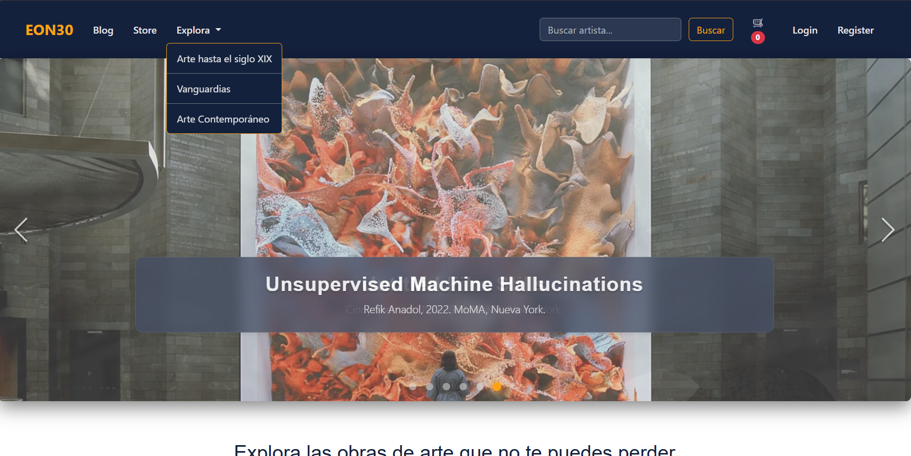
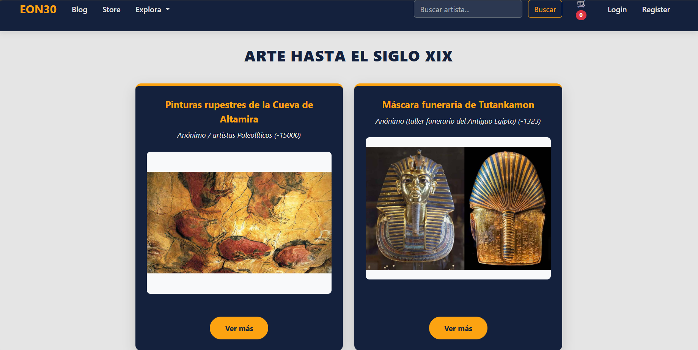
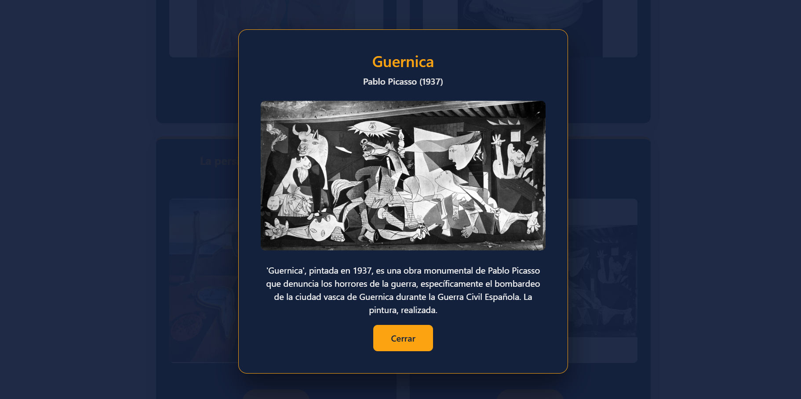

# Art Gallery – Full Stack Application

Final project developed as a team during a Full Stack Bootcamp.

## Tech Stack
- Angular
- Node.js
- Express
- MongoDB
- Mongoose

## How to Run the Project

### Backend

Navigate to the backend folder:
``` bash
cd Backend
npm install
npm run dev
```
The backend will run on:
http://localhost:3000

### Frontend

Navigate to the frontend folder:
``` bash
cd Frontend
npm install
ng serve
```
The frontend will run on:
http://localhost:4200


## My Contribution
### Backend
- Database design and integration
- Backend development with Node.js and Express
- REST API development
- Server setup and development workflow with nodemon

### Frontend
- Navbar design and styling
- Implementation of frontend functionality
- Use of Angular selectors and component logic

## Screenshots

### Home


### Navbar


### Gallery


## Team Project
Developed collaboratively by a team of three developers.
